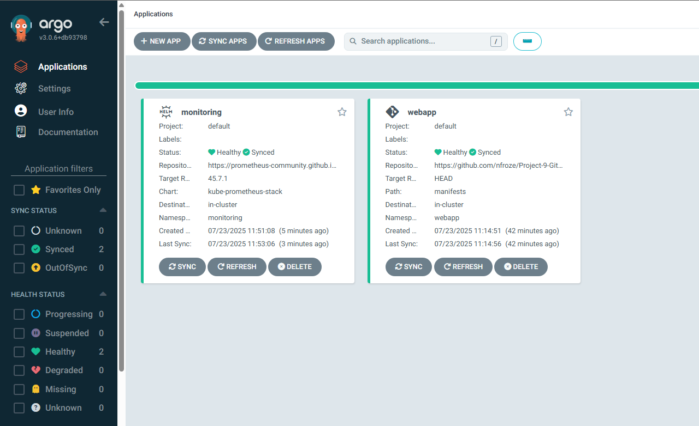
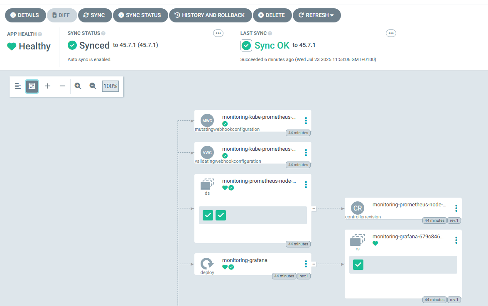
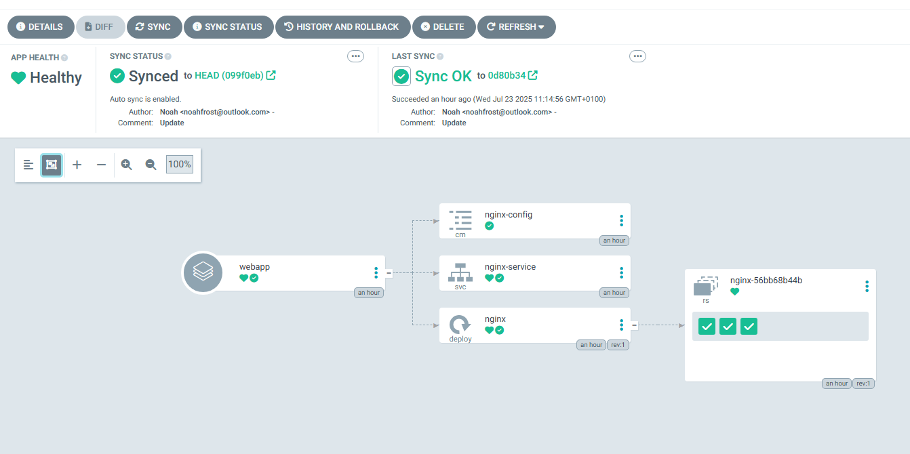
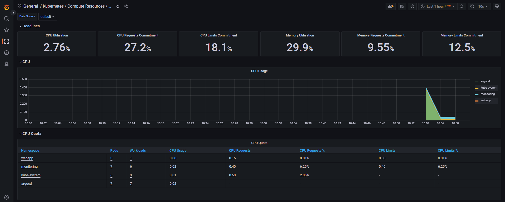
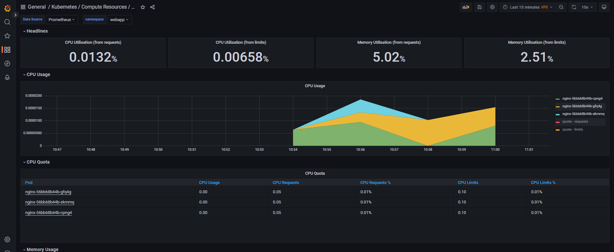
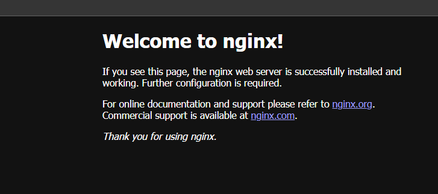
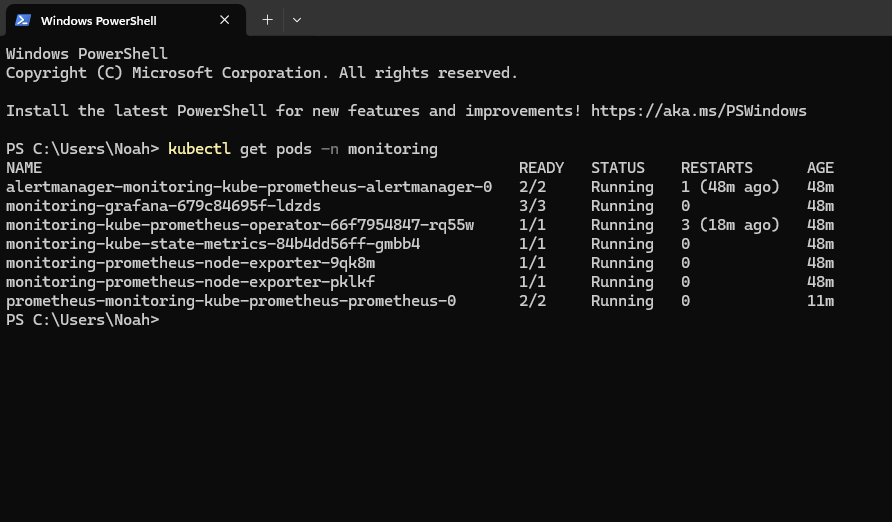
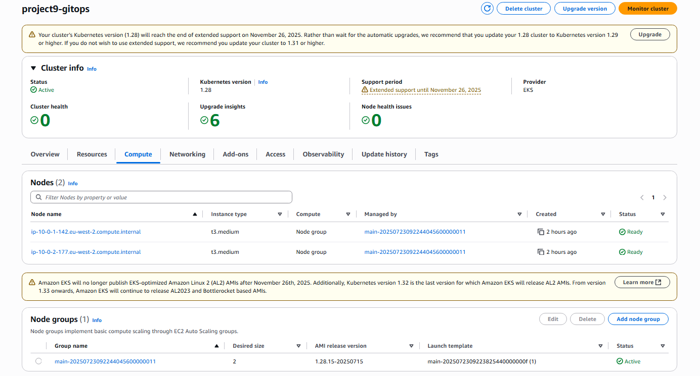

# Project 9: GitOps Monitoring

GitOps workflow with ArgoCD on AWS EKS. Prometheus and Grafana deployment via Helm. Automatic synchronisation from Git repository.

## Technologies

AWS EKS • Terraform • ArgoCD • Prometheus • Grafana • Helm • Kubernetes

## Screenshots

